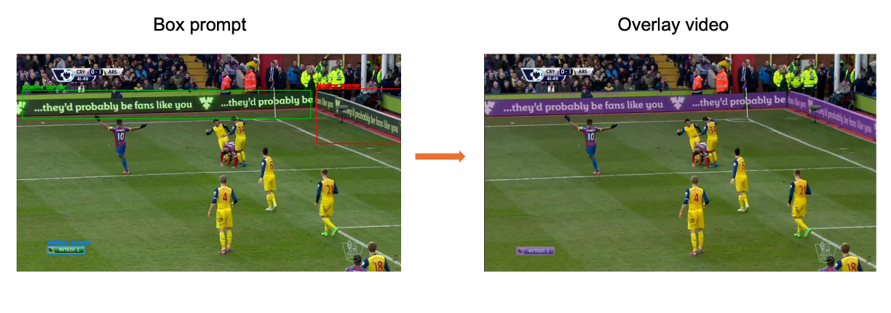

Project Billboard
=============================

A minimal, reproducible toolkit for perimeter‑billboard segmentation in sports video. It ships ready‑to‑run pipelines (SAM‑2 or XMem) with optional auto‑prompting (OWL‑ViT, Moondream, or a fine‑tuned YOLO11 seeder) and shot detection.

What’s reproducible:
- **Overlays & seed snapshots**: run on your own clips with no ground truth.
- **Metrics (IoU/BIoU/jitter)**: produced only when LabelMe GT masks exist under `sam2/data/gt_frames/<clip_id>/`.

Pick a pipeline under `sam2/` or `xmem/`, set up the env, and run one of the examples below. (XMem requires CUDA; SAM‑2 seeding can run on CPU/MPS.)


Workflow
-------------------


Clone & Setup
-------------------
```bash
# clone & env
git clone https://github.com/jiajiashao/project_billboard.git
cd project_billboard/envs
conda env create -f envs/environment.yml
conda activate sam2 

# sanity: python and (optional) CUDA in THIS env
python -c "import sys; print(sys.version)"
python -c "import torch; print('cuda=', torch.cuda.is_available(), torch.version.cuda if torch.cuda.is_available() else None)"

# (Windows) if you hit cv2 import errors
pip install --upgrade opencv-python-headless

# ffmpeg present?
ffmpeg -version
```

This repo contains eight entry-point pipelines (SAM-2 and XMem variants) plus supporting prompt/shot-detection tooling. Paths below are repo‑relative unless stated.

Environments
------------
- Conda/venv specs: `envs/environment.yml`, `envs/requirements.txt`.
- Create/activate an env that matches your runner (CUDA for XMem; CPU/MPS is fine for SAM-2 seeding only).
- Example setup: `conda env create -f envs/environment.yml` or `python -m venv .venv && pip install -r envs/requirements.txt`; then `conda activate <env>` or `source .venv/bin/activate`.

Data layout (relative to `--data-root` or `--root`)
---------------------------------------------------
For SAM-2 follow the below path(s) for data.
- `project_billboard/sam2/data/clips/<clip_id>.mp4` (input videos)
- `project_billboard/sam2/data/gt_frames/<clip_id>/frame_*.jpg` (pre-extracted frames, if present)
- `project_billboard/sam2/data/gt_frames/<clip_id>/frame_*.json` (LabelMe-style GT masks; used for fallback seeding/metrics)

For XMem follow the below path(s) for data.
- `project_billboard/xmem/data/clips/<clip_id>.mp4` (input videos)
- `project_billboard/xmem/data/gt_frames/<clip_id>/frame_*.jpg` (pre-extracted frames, if present)
- `project_billboard/xmem/data/gt_frames/<clip_id>/frame_*.json` (LabelMe-style GT masks; metrics)
- `project_billboard/xmem/data/gt_frames/<clip_id>/00000.png` (pre-extracted binary frames; used for seeding)

Additionally the prompts list is provided under project root project_billboard:
- Prompts list: `prompts_list.txt`

Models / weights
----------------
**Place or auto‑download weights exactly to these paths:**

- **SAM‑2** Pulled automatically by HuggingFace on first run: `facebook/sam2.1-hiera-tiny`

- **XMem checkpoint** (CUDA only)
Please download the XMem checkpoint from [Google Drive](https://) and place it inside: 
  - `project_billboard/xmem/model/xmem/saves/`

- **OWL‑ViT** (auto‑prompt)
  - Pulled automatically by HuggingFace on first run: `google/owlv2-base-patch16-ensemble`

- **Moondream** (auto‑prompt)
  - Pulled on first run. If you hit Pillow conflicts, pin `pillow==10.4.*` in your env.

- **YOLO11 finetuned**
We provide the YOLO11n checkpoints finetuned on our dataset. 
  - `project_billboard/sam2/sam2_yolo11/weights/best.pt`
  - `project_billboard/xmem/xmem_yolo11/weights/best.pt`

Outputs
-------
- SAM-2: under `project_billboard/sam2/runs/<config>/<run_id>/` (overlay MP4, per-shot annotated JPGs, `re_prompts_*.csv`, `pilot_*.log`, summary CSVs).
- XMem: under `project_billboard/xmem/outputs/<run_id>/` (or `xmem/outputs/G_<clip>/runs/<run_id>/` for YOLO/XMem). You get masks PNGs, overlay MP4 (when XMem runs), `re_prompts_*.csv`, per-shot seed JPGs, pilot log, summary CSV.

Example: after a SAM‑2 GT baseline on `clip_corner`, look under `sam2/runs/*/<run_id>/clip_corner/overlay.mp4` and `.../pilot_*.log`.


- Output example 1: Prompt boxes and overlay screenshot from run "clip_corner + OWL-ViT + SAM-2".


- Output example 2: Overlay from run "clip_gentle + YOLO11n + SAM-2". The billboard is propagated with purple masks.
  
  
  
  [📹 Download original video (MP4)](appendent/overlay_clip_gentle_YOLO_sam2.mp4)


Known requirements / pitfalls
-----------------------------
- XMem **requires a CUDA-capable GPU**; on CPU/Mac it will exit early. Use `--skip-xmem` to debug seeds only.
- `cv2` import errors on some Python builds; reinstall OpenCV (`pip install opencv-python-headless`) in the active env.
- HuggingFace model downloads may warn about symlinks; use `HF_HUB_DISABLE_SYMLINKS_WARNING=1` if needed.

Entry points and key CLI flags
------------------------------

Each pipeline contains a prompter that generates box prompter and a segmentation model that produce masks.


- Prompts precedence: `--prompts` (CLI) > `--prompts-file` > built‑in defaults.
- Path args differ: SAM‑2 uses `--data-root`, XMem uses `--root`.
For each program, start by cd‑ing into the directory that contains its main.py, which keeps the command-line arguments to a minimum. For example:
 
`cd /project_billboard/xmem/xmem_yolo11`
`python main_yolo.py <required args>`

1) `../project_billboard/sam2/sam2_gt/main.py`
   - Required args: `--clips <id[,id2...]>`
   - Optional args:
     - `--data-root <path>` (default `./../data`)
     - `--weights <checkpoint_or_repo>` (default `facebook/sam2.1-hiera-tiny`)
     - `--runs-root <path>` (default `runs`)
     - `--device {cuda,cpu,mps}` (default `cuda`, auto-fallback if unavailable)
     - `--reseed` (flag; disabled by default)


2) `sam2/sam2_gt_shotdetector/main.py`
   - Args: same as above plus shot detection baked into pipeline.


3) `../project_billboard/sam2/sam2_moondream/main.py`
- Required args: `--prompts "<comma/semicolon-separated terms>"`, `--clips <id[,id2...]>`
- Optional args:
  - `--data-root <path>` (default `./../data`)
  - `--weights <checkpoint_or_repo>` (default `facebook/sam2.1-hiera-tiny`)
  - `--runs-root <path>` (default `runs`)
  - `--device {cuda,cpu,mps}` (default `cuda`, auto-fallback if unavailable)
  - `--auto-prompt` (flag; enabled by default)
  - `--moondream-model <hf_repo_or_path>` (default `vikhyatk/moondream2`)
  - `--moondream-device <device>` (default None; falls back to SAM-2 device logic)
  - `--moondream-threshold <float>` (default `0.10`)
  - `--prompts-file <path>` (alternatively provide prompts via file; overrides `--prompts` if set)
  - `--autoprompt-fallback {none}` (default `none`)


4) `../project_billboard/sam2/sam2_owlvit/main.py`
- Required args: `--prompts "<comma/semicolon-separated terms>"`, `--clips <id[,id2...]>`
- Optional args (same base options as the Moondream runner, with OWL-ViT-specific fields highlighted):
  - `--data-root <path>` (default `./../data`)
  - `--weights <checkpoint_or_repo>` (default `facebook/sam2.1-hiera-tiny`)
  - `--runs-root <path>` (default `runs`)
  - `--device {cuda,cpu,mps}` (default `cuda`, auto-fallback if unavailable)
  - `--auto-prompt` (flag; enabled by default)
  - `--owlvit-model <hf_repo_or_path>` (default `google/owlv2-base-patch16-ensemble`)
  - `--owlvit-device <device>` (default `None`; falls back to SAM-2 device logic)
  - `--owlvit-score-thr <float>` (default `0.15`)
  - `--prompts-file <path>` (alternative to `--prompts`; overrides it when provided)
  - `--autoprompt-fallback {none,gt}` (default `none`)


5) `../project_billboard/sam2/sam2_yolo11/main.py`
- Required args:
  - `--data <video_or_directory>` — path to a single clip or a directory of clips (recurses for common video extensions). Example: `--data ../project_billboard/sam2/data/clips/clip_corner.mp4`
- Optional args:
  - `--out-dir <path>` (default `runs/yolo_sam2`) – root folder for outputs; per-clip subfolders get a timestamp.
  - `--yolo-model <path>` (default `./weights/best.pt`) – YOLO checkpoint for seeding boxes.
  - `--yolo-conf <float>` (default `0.20`) – YOLO confidence threshold.
  - `--yolo-max-objects <int>` (default `3`) – max YOLO detections per shot start.
  - `--sam2-weights <checkpoint_or_repo>` (default `facebook/sam2.1-hiera-tiny`) – SAM-2 video weights.
  - `--input-width <int>` (default `1280`) – resize width for decoded frames (aspect preserved).
  - `--device {cpu,cuda,mps}` (default `cuda`) – compute device for YOLO + SAM-2.
  - `--stride <int>` (default `1`) – sampling stride for metrics/visualization.
  - `--shot-mode {auto,single}` (default `auto`) – auto-detect shot boundaries or treat the clip as a single shot.
  - `--gt-root <path>` (default `..\sam2\data\gt_frames`) – ground-truth masks for metrics, when available.


6) `../project_billboard/xmem/xmem_gt/main_gt.py`
- Required args: *(none — script runs with defaults; `clip_fast` is used when `--clip` is omitted)*
- Optional args:
  - `--root <path>` (default `./../`) – project root containing `data/`, `model/`, `work/`, etc.
  - `--clip <id>` (default `clip_fast`) – clip ID (expects `data/clips/<id>.mp4` and `data/seeds/<id>/00000.png`).
  - `--device {cuda,cpu}` (default `cuda`) – XMem execution device.
  - `--frames <int>` (default `-1`) – limit how many frames to extract (`-1` = all).
  - `--width <int>` – resize width when extracting frames (keeps aspect).
  - `--stride <int>` (default `1`) – metrics sampling stride.
  - `--run-id <name>` (default `xmem`) – suffix for run directories/files.
  - `--run-notes` – write a simple `RUN_NOTES.md` in the run folder.
  - `--run-only` – skip metrics/summary; just prepare overlays and masks.
  - `--xmem-root <path>` – override the XMem repo path (defaults to `<root>/model/xmem`).


7) `../project_billboard/xmem/xmem_owlvit/main_owlvit.py`
- Required args: `--clip <id or filename>` (defaults derive `.mp4` from the clip ID)
- Optional args:
  - `--root <path>` (default `./../`) – project root containing `data/`, `model/`, etc.
  - `--width <int>` – resize width when extracting frames (aspect preserved).
  - `--stride <int>` (default `1`) – stride used for summary metrics.
  - `--run-id <name>` – custom suffix for the run folder (defaults to `clip_<id>_<timestamp>`).
  - `--run-notes` – write `RUN_NOTES.md` in the run directory.
  - `--run-only` – skip metrics/summary CSVs (just prep masks/overlays).
  - `--shot-detect` – enable per-shot processing.
  - `--shot-method {adaptive,content}` (default `adaptive`) – strategy used when `--shot-detect` is on.
  - `--shot-min-seconds <float>` (default `1.0`) – minimum shot duration for detection.
  - `--auto-prompt` (flag; enabled by default) – turn OWL-ViT seeding on/off.
  - `--owlvit-model <hf_repo_or_path>` (default `google/owlv2-base-patch16-ensemble`).
  - `--owlvit-device <device>` – override device just for OWL-ViT (defaults to SAM device logic).
  - `--owlvit-score-thr <float>` (default `0.15`).
  - `--prompts "<comma/semicolon separated terms>"` – text prompts fed to OWL-ViT.
  - `--prompts-file <path>` – alternative to inline prompts (first non-empty lines win).
  - `--autoprompt-fallback {gt,skip}` (default `skip`) – use GT seeds when OWL-ViT yields none.
  - `--seed-erosion <int>` (default `1`) – erosion iterations when rasterizing prompt boxes.
  - `--bbox-pad <int>` (default `6`) – padding applied to boxes before seeding.
  - `--owlvit-debug` – dump extra OWL-ViT diagnostics.
  - `--skip-xmem` – only generate prompts/seeds; skip XMem propagation.


8) `../project_billboard/xmem/xmem_yolo11/main_yolo.py`
- Required args: `--clip <id>` (expects `data/clips/<id>.mp4`)
- Optional args:
  - `--root <path>` (default `./../`) – XMem project root containing `data/`, `model/`, `work/`, etc.
  - `--device {cuda,cpu}` (default `cuda`)
  - `--width <int>` – resize width when extracting frames (aspect preserved).
  - `--stride <int>` (default `1`)
  - `--run-id <name>` (default `xmem_yolo`)
  - `--run-notes` – emit `RUN_NOTES.md` in the run directory.
  - `--run-only` – skip metrics/summary generation.
  - `--shot-detect` – enable per-shot processing.
  - `--shot-method {adaptive,content}` (default `adaptive`)
  - `--shot-min-seconds <float>` (default `1.0`)
  - `--auto-prompt` (flag; enabled by default) – toggle YOLO seeding.
  - `--yolo-model <path>` (default `xmem_xmem_yolo11/weights/best.pt`) – YOLO checkpoint.
  - `--yolo-conf <float>` (default `0.20`)
  - `--yolo-max-objects <int>` (default `3`)
  - `--yolo-imgsz <int>` – inference resolution for YOLO (defaults to `--width` or `1280`).
  - `--autoprompt-fallback {gt,skip}` (default `skip`)
  - `--seed-erosion <int>` (default `1`)
  - `--yolo-debug` – dump extra YOLO diagnostics.
  - `--skip-xmem` – generate prompts/seeds only; skip XMem propagation.

Troubleshooting (common in this repo)
-------------------------------------
- **“No clips were processed”** → check `--data-root/--root` and the `--clips/--clip` name exists under `data/clips/` (or `data/frames/` if running from frames).
- **CUDA available but script falls back to CPU** → verify in the same env: `python -c "import torch; print(torch.cuda.is_available())"`. If `False`, you’re not on the right conda/venv.
- **HuggingFace symlink warning on Windows** → set once and reopen shell: `setx HF_HUB_DISABLE_SYMLINKS_WARNING 1`.
- **OpenMP conflict during YOLO training** (`libomp` vs `libiomp5md`) → temporary workaround: `setx KMP_DUPLICATE_LIB_OK TRUE` then restart shell.
- **`cv2` import errors** → reinstall OpenCV in the active env: `pip install --upgrade opencv-python-headless`.

Tested / hardware
-----------------
- XMem eval: CUDA GPU required (fails fast if `torch.cuda.is_available()` is False).
- OWL-ViT / YOLO seeding: runs on CPU if CUDA is absent (but masks require CUDA).

Notes
-----
- Ensure video clips are present under `data/clips/` before running.
- Prompts: keep a reusable list in `prompts_list.txt` and pass via `--prompts-file` when supported.
- For seed-only debugging on non-CUDA hosts, use `--skip-xmem` in the XMem OWL-ViT/YOLO wrappers; inspect `re_prompts_*.csv` and `shot_XXX_seed.jpg`.

Acknowledgements
----------------
This repository assembles wrappers and helpers around the following open‑source models and libraries. Please refer to their original licenses and documentation for usage terms and citations:

- **SAM-2 (Segment Anything Model 2)** — Meta AI — [facebookresearch/segment-anything-2](https://github.com/facebookresearch/segment-anything-2) — License: **Apache-2.0** (plus third-party components noted in repo).
- **XMem** (long-term video object segmentation) — [hkchengrex/XMem](https://github.com/hkchengrex/XMem) — License: **MIT**.
- **OWL-ViT / OWL-V2** (open-vocabulary detection) — Google Research Scenic — [google-research/scenic/projects/owl_vit](https://github.com/google-research/scenic/tree/main/scenic/projects/owl_vit) — License: **Apache-2.0**.
- **Moondream2** (lightweight VLM for box proposals) — Hugging Face model card: [vikhyatk/moondream2](https://huggingface.co/vikhyatk/moondream2) — License: **Apache-2.0**.
- **Ultralytics YOLO11** (first-frame seeding) — [ultralytics/ultralytics](https://github.com/ultralytics/ultralytics) — License: **AGPL-3.0**.
- **PySceneDetect** (shot detection) — [Breakthrough/PySceneDetect](https://github.com/Breakthrough/PySceneDetect) — License: **BSD-3-Clause**.
- **OpenCV** (I/O & vision utils) — [opencv/opencv](https://github.com/opencv/opencv) — License: **Apache-2.0** (OpenCV ≥4.5).
- **FFmpeg** (video decoding/encoding) — [ffmpeg.org](https://ffmpeg.org) — License: **LGPL-2.1+**/**GPL-2.0+** (depending on build options).
- **Hugging Face Transformers** — [huggingface/transformers](https://github.com/huggingface/transformers) — License: **Apache-2.0**.
- **huggingface_hub** — [huggingface/huggingface_hub](https://github.com/huggingface/huggingface_hub) — License: **Apache-2.0**.
- **timm (PyTorch Image Models)** — [huggingface/pytorch-image-models](https://github.com/huggingface/pytorch-image-models) — License: **Apache-2.0**.

We thank the respective authors and communities for making these resources available.

Appendent
----------------
Output analysis from 69 runs across the data video clips and configurations:

